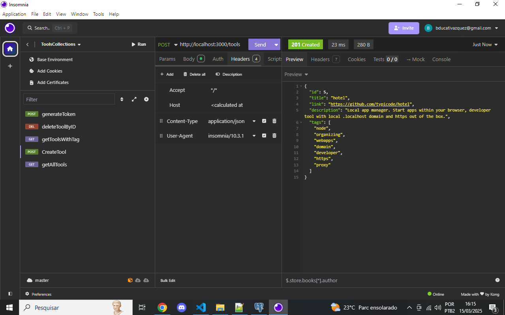
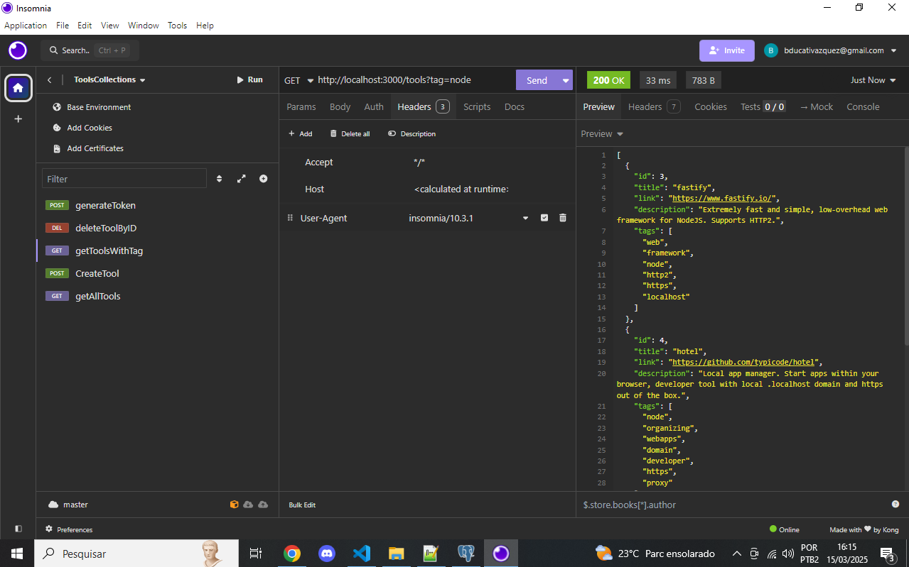
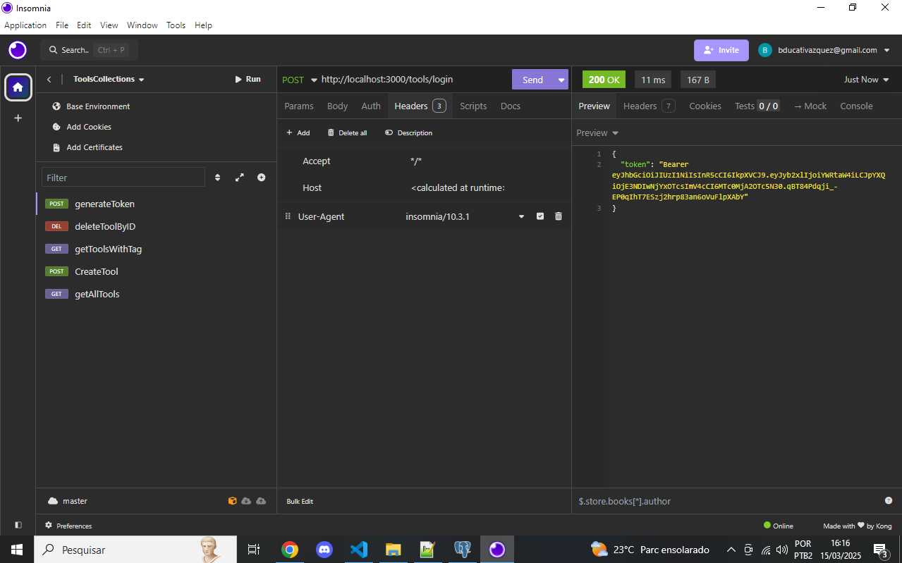
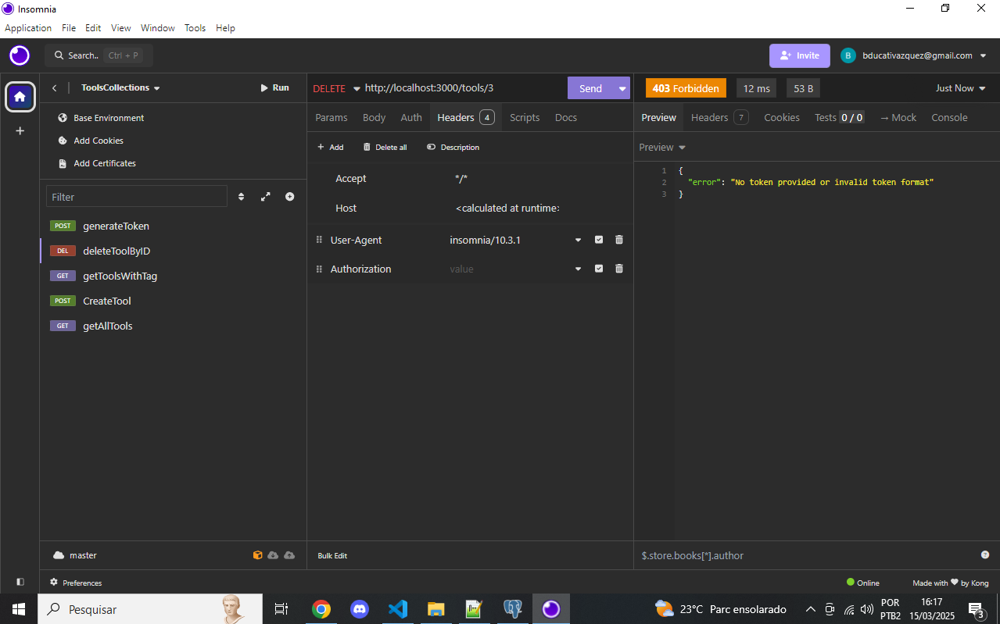
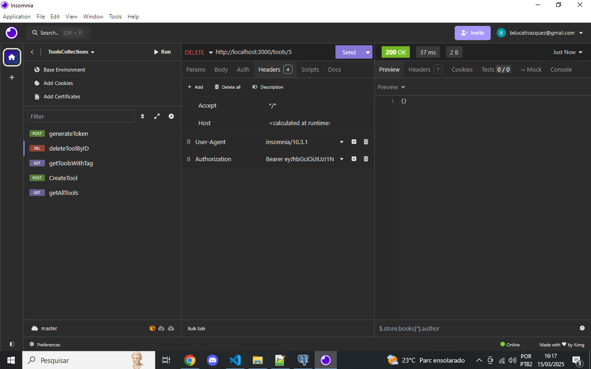

# Desafio Backend - Bossabox

Este repositório contém a solução para o desafio backend proposto pela Bossabox. O objetivo era desenvolver uma API para gerenciar ferramentas, permitindo operações como cadastro, listagem, filtragem por tags e exclusão de ferramentas. A aplicação foi desenvolvida utilizando Node.js, PostgreSQL e Docker.

## 📋 Descrição do Desafio

O desafio consistia em criar uma API RESTful para gerenciar uma lista de ferramentas, onde cada ferramenta possui um nome, link, descrição e tags. A API deveria permitir:

- Cadastrar uma nova ferramenta.
- Listar todas as ferramentas cadastradas.
- Filtrar ferramentas por tags.
- Excluir uma ferramenta específica.

## Bônus realizados

- Conteinerização da aplicação;
- Autenticação e autorização (**OAuth, JWT**);

## 🛠️ Ferramentas Utilizadas

- **Node.js**: Ambiente de execução JavaScript utilizado para desenvolver a API.
- **PostgreSQL**: Banco de dados relacional para armazenar as ferramentas.
- **Docker**: Para conteinerização da aplicação e do banco de dados, facilitando a execução em diferentes ambientes.
- **JWT (JSON Web Tokens)**: Para autenticação e proteção das rotas.

## 📸 Demonstração

Aqui estão algumas capturas de tela que demonstram o funcionamento da aplicação:

1. **Listando todas as ferramentas cadastradas:**
   

2. **Criando uma nova ferramenta:**
   

3. **Filtrando ferramentas por uma tag específica:**
   

4. **Gerando um token de acesso:**
   

5. **Tentativa de exclusão sem token (erro):**
   

6. **Exclusão de uma ferramenta com token válido:**
   

## 🚀 Como Executar a Aplicação

Para rodar a aplicação, siga os passos abaixo:

1. **Clone o repositório:**

   ```bash
   git clone https://github.com/seu-usuario/Desafio-Backend.git
   cd Desafio-Backend

Certifique-se de ter o Docker e o Docker Compose instalados. Em seguida, execute o seguinte comando:

   ```bash
    docker-compose up
